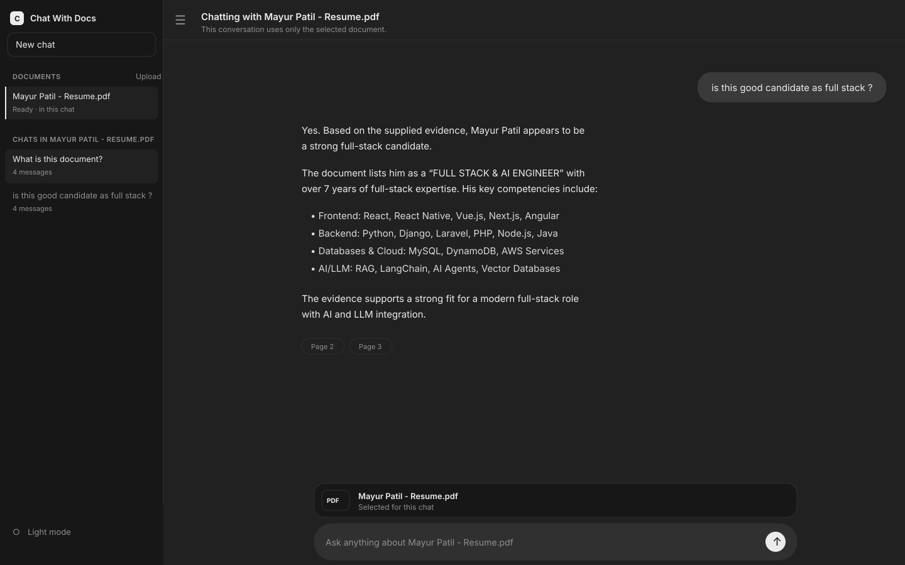

# Chat With Docs

Local-first, citation-grounded document RAG built around a fixed JCode workflow.

## Project preview



The interface keeps documents and conversations in the sidebar while answers stay grounded in the selected file and expose page citations.

## Current vertical slice

`PDF/DOCX upload -> background processing -> page/chunk extraction -> SQLite FTS5 -> ready-only one-document chat`

The first implementation uses SQLite, a database-backed queue, local file storage, and a deterministic retrieval path. JCode should invoke an agentic recovery path only when extraction, retrieval, or citation validation fails. `LLM_PROVIDER=mock` keeps local startup credential-free. Set `LLM_PROVIDER=deepseek` and `DEEPSEEK_API_KEY` to use the DeepSeek connector, or use another OpenAI-compatible provider with `LLM_API_KEY`. The server assigns citations from retrieved chunks, so the model cannot invent page references.

## Run locally

```bash
npm install
cp .env.example .env
npm run dev
```

The web UI and API start at `http://localhost:3000`. OpenAPI is in [`openapi.yaml`](./openapi.yaml).

The default server binds to `127.0.0.1` and is intended for local, single-user use. It has no authentication or multi-user authorization yet; do not expose it directly to the public internet. For deployment guidance, see [`docs/open-source.md`](./docs/open-source.md).

### Configuration

Copy `.env.example` to `.env` before starting. Important settings include:

- `HOST` and `PORT`: network binding; keep `HOST=127.0.0.1` for local use.
- `MAX_REQUEST_BYTES`: maximum JSON request size, default 15 MiB.
- `MAX_UPLOAD_BYTES`: maximum decoded PDF/DOCX size, default 10 MiB.
- `MAX_DOCUMENT_PAGES`: maximum pages processed per document, default 100.
- `MAX_EXTRACTED_TEXT_BYTES`: maximum extracted UTF-8 text per document, default 10 MiB.
- `RATE_LIMIT_WINDOW_MS` and `RATE_LIMIT_MAX_REQUESTS`: in-memory per-client API limit, default 120 requests per minute.
- `LLM_REQUEST_TIMEOUT_MS`: maximum time to wait for a non-mock provider response, default 30 seconds.
- `LLM_PROVIDER=mock`: credential-free deterministic mode for local development.
- `LLM_PROVIDER=deepseek` or another compatible provider: requires the corresponding server-side API key.

### Docker

For a persistent self-hosted instance:

```bash
cp .env.example .env
docker compose up --build
```

The database and uploaded files are stored in the `chat_with_docs_data` Docker volume. This image is suitable for private deployments behind a TLS-terminating reverse proxy, but authentication and multi-user authorization are not included yet.

### API example

```bash
curl http://localhost:3000/health
curl http://localhost:3000/v1/documents
```

Upload a document through the web UI or by sending the JSON shape shown below. Poll the returned job until its document is `ready` before asking questions.

Upload JSON example:

```json
{
  "filename": "example.pdf",
  "mimeType": "application/pdf",
  "contentBase64": "<base64 file contents>"
}
```

Equivalent upload request using the local API:

```bash
CONTENT_BASE64="$(base64 -w 0 ./example.pdf)"
curl -X POST http://localhost:3000/v1/documents \
  -H 'content-type: application/json' \
  -d "{\"filename\":\"example.pdf\",\"mimeType\":\"application/pdf\",\"contentBase64\":\"${CONTENT_BASE64}\"}"
```

The upload returns a job ID. Poll `GET /v1/jobs/{jobId}` until the document reaches `ready`, then call `POST /v1/documents/{documentId}/chat` with `{ "question": "..." }`.

The complete endpoint contract is available in [`openapi.yaml`](./openapi.yaml), including conversation creation, archiving, search, and deletion.

### Development checks

```bash
npm run typecheck
npm test
```

The test suite includes an isolated HTTP smoke test covering upload, processing, search, grounded chat, and deletion. Contributions should add coverage for new API behavior and security-sensitive input handling.

Rate limiting is process-local and resets when the server restarts. It is intended to prevent accidental local loops, not to replace a reverse-proxy or distributed rate limiter for a multi-instance deployment.

## Project policies

- [Contributing guide](./CONTRIBUTING.md)
- [Security policy](./SECURITY.md)
- [Code of conduct](./CODE_OF_CONDUCT.md)
- [Changelog](./CHANGELOG.md)
- [MIT License](./LICENSE)

## Planned adapters

- OCR adapter for image-only PDF/DOCX content
- OpenAI-compatible LLM answer adapter
- DeepSeek API connector (`DEEPSEEK_API_KEY`)
- Inline queue for local development
- Redis queue connector
- PostgreSQL repository adapter
